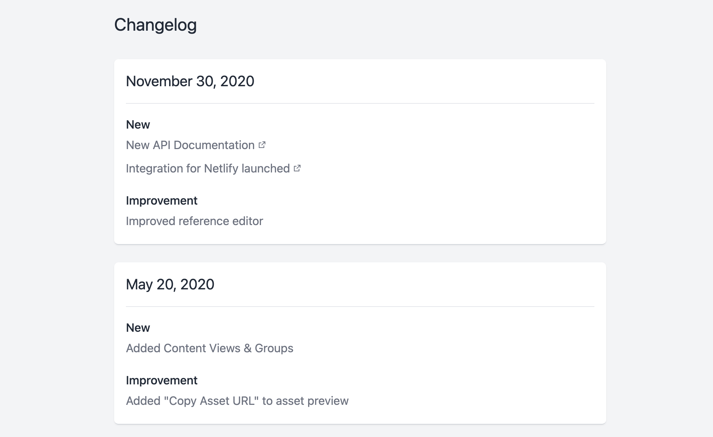

# gatsby-starter-changelog



## Generating schema

This project uses a specific GraphCMS schema. Before anything else, you'll want to create a GraphCMS project, and obtain your API endpoint, and a Management API token.

Then, run:

```bash
node ./migrations/schema.js -e YOUR_ENDPOINT -t YOUR_TOKEN
```

Once this completes, it will create all the necessary models + fields inside GraphCMS for you automatically.

## Running locally

Once you clone the repo, you'll need to create the file `.env` that contains your GraphCMS endpoint in the format of:

```
GRAPHCMS_ENDPOINT=
```

You'll also need to set your Public API permissions to public from PUBLISHED stage. You may also want to use a token, but in the case of this changelog, everything is public by default.

Then, run `npm install`, and `npm run dev` to get going!
